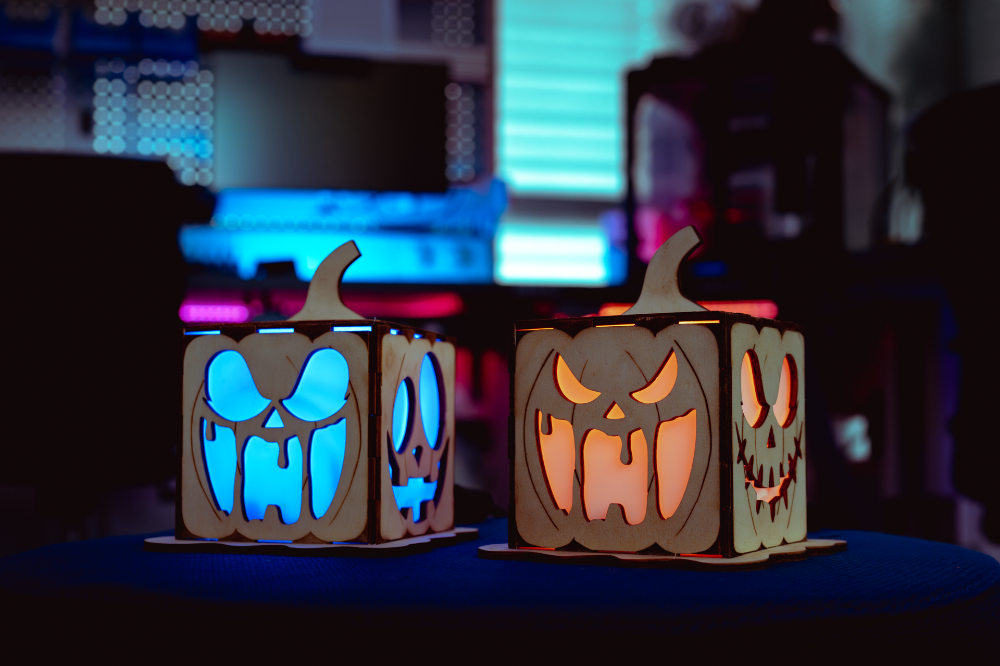

*Dieses Projekt ist neu bei uns. Hilf es uns zu verbessern :) Du kannst dieses GitHub Projekt gerne erweitern und anpassen!*

# Programmierbares LED Halloween-Haus

## Projektbeschreibung

Das Halloweenhaus ist ein DIY-Projekt für Kinder und Eltern, das Basteln, Technik und Kreativität verbindet. Mit einem Lasercutter, einfachen Elektronik-Komponenten (Arduino, NeoPixel-LED, Button) und etwas Heißkleber entsteht ein leuchtendes, individuell gestaltbares Halloweenhaus. Die Anleitung ist so geschrieben, dass sie auch ohne Vorkenntnisse leicht verständlich ist und Schritt für Schritt durch den gesamten Bauprozess führt.

---

## Was erwartet dich?

- **Lasercutter-Dateien** für alle Holz- und Kunststoffteile
- **Einfache Verkabelung** mit Arduino Uno R3 und NeoPixel-LED
- **Programmier-Anleitung** für verschiedene LED-Modi (Kerzenlicht, Farbwechsel, Regenbogen)
- **Bebilderte Schritt-für-Schritt-Anleitung** für den Zusammenbau
- **Tipps für kindgerechtes Basteln und sicheres Arbeiten**

---

## Was brauchst du?

- Zugang zu einem Lasercutter
- Joy-it ARD-ONE-C (oder kompatibel)
- NeoPixel-LED (WS2812)
- USB-A zu USB-C Kabel
- 3 Steckleitungen (männlich + weiblich)
- Button (Taster)
- Heißkleber
- Sekundenkleber
- Plexiglas 3mm und milchig für die Fenster
- Holzplatten 4mm
- Die bereitgestellten LightBurn-Dateien und Arduino-Code
- Papiertücher
- Dünne Holzstreifen

---

## Viel Spaß beim Basteln und ein schaurig-schönes Halloween!

[>Die Schritt-für-Schritt-Anleitung findest du hier!<](ressourcen/Beschreibung_Design_Dateien.md)
