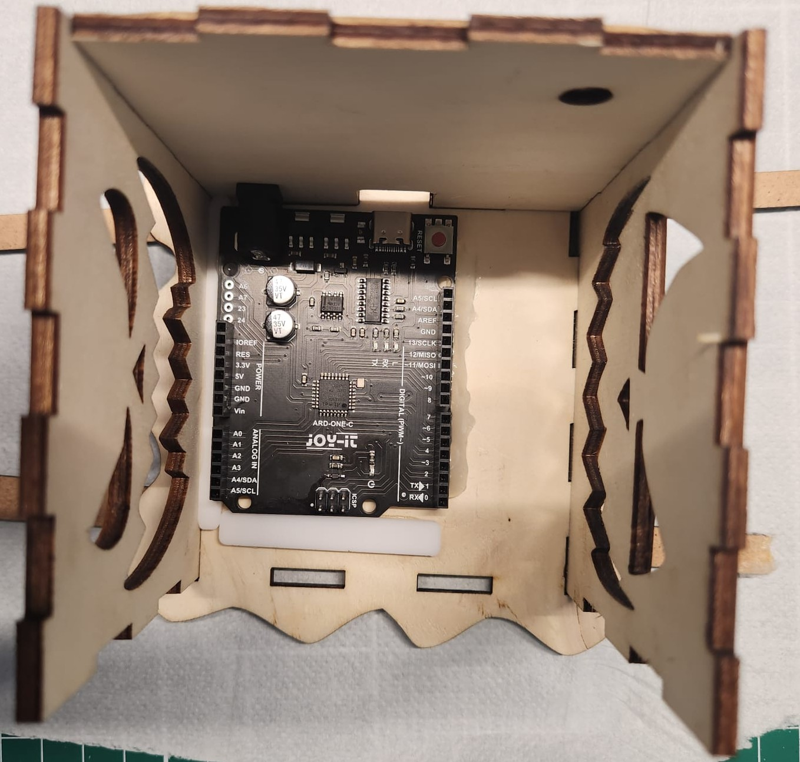

**Wichtiger Hinweis:**
Wenn du den Lasercutter noch nie benutzt hast, ist es **verpflichtend**, die Sicherheitshinweise im [Moodle-Kurs Lasercutter](https://elearning-poc.rohde-schwarz.com/course/view.php?id=19) zu beachten. (Gastzugang möglich)  
Der Kurs erklärt die grundlegende Bedienung, Sicherheitsregeln und wichtige Einstellungen.  

Diese Anleitung hier ist eine kompakte Schritt-für-Schritt-Kurzfassung speziell für den Bau des Halloweenhauses.

# Inhaltsverzeichnis

- [1. Laserdateien vorbereiten](#1-laserdateien-vorbereiten) (1 Stunde + 2,5 Stunden Laserung) 
    Material: lightburn, Lightburn dateien, Kunstoff, Holz,  
- [2. Microcontroller vorbereiten und programmieren](#2-Microcontroller-vorbereiten-und-programmieren) (30min) 
    Material: Microcontroller, USB-Kabel, Arduino IDE Software
- [3. Individualisieren](#3-individualisieren) (individuell) 
- [4. Verkabeln ](#4-verkabeln) (30min) 
    Material: Microcontroller, LED, Button, Leitungen
- [5. Haus zusammenkleben](#5-haus-zusammenkleben) (1 Stunde) 
    Material: Sekundenkleber, Heißkleber, Papiertücher, Holzleisten, Feile,
- [Geschafft!](#geschafft)

# 1. Laserdateien vorbereiten

**Willkommen zum ersten Schritt**! 
Jetzt geht’s los mit dem **kreativen** Teil: Du gestaltest dein eigenes Halloweenhaus. Die Laserdateien bilden später die Gesichter und Details deines Halloweenhauses.

**Hinweis**: Die Laser-Dateien stellen später u.a. deine Gesichter dar, du kannst sie natürlich frei anpassen und gestalten.

**Was ist LightBurn**? 
LightBurn ist eine Software zur Steuerung von Lasercuttern. Mit ihr kannst du Vektorgrafiken bearbeiten, Schnitt- und Gravurpfade festlegen und die finale Datei für den Lasercutter vorbereiten.
-->[LightBurn herunterladen](https://lightburnsoftware.com/pages/download-trial)

**Bearbeitung der Laserdateien**: 
Die Bearbeitung der Dateien erfolgt in der **Garage**.

Zugriff auf den Lasercutter: 
Der Rechner, über den du später auf den Lasercutter zugreifst, befindet sich im **OG 1**, direkt links nach dem Treppenhaus, dann **rechts** ganz durch bis in die **Werkstatt**.
Es ist der **zweite** Rechner auf der **linken** Seite.

  

**LightBurn öffnen**: 
Öffne das Programm LightBurn **zweimal**. Das geht am einfachsten, wenn du unten in der Windows-Suchleiste nach **„LightBurn“** suchst und das Programm zweimal startest.

**Warum zweimal öffnen**? 
So kannst du bequem Teile aus dem Baukasten in einem Fenster markieren und mit **Strg + C** kopieren, um sie im anderen Fenster mit **Strg + V** einzufügen. Das erleichtert die individuelle Gestaltung deines Halloweenhauses.

Beim Öffnen der Datei kann ein Fenster erscheinen, das dich etwas fragen möchte. Klicke hier immer auf **„Nein“** – das ist wichtig, damit nichts verändert wird.

**Dateien aus dem Baukasten verwenden**: 
Klicke in GitHub auf der linken Seite auf den Ordner „lightburn“. Dort findest du die Vorlagen, die du gleich brauchst.

**Download der Datei**: 
Oben rechts im GitHub-Fenster befindet sich ein kleiner Pfeil nach unten – das ist der Download-Knopf. Wenn du darauf klickst, wird die Datei auf deinen Computer heruntergeladen.

Manchmal sind die **LightBurn-Dateien** ziemlich groß. Damit du alles sehen kannst, musst du ein bisschen **herauszoomen** – das geht ganz einfach mit dem **Mausrad**. So bekommst du einen besseren Überblick, als würdest du ein großes Bild von weiter weg anschauen.

Im ersten Fenster öffnest du die Datei **Kuerbis_Haus_Bausteine.lbrn2**.
Im zweiten Fenster öffnest du die Datei **Holzbauteile.lbrn2**. Diese Datei wird später am Lasercutter ausgeführt.

In der Datei **„Bausteine“** benötigst du folgende Teile: 

  1. Zubehör 
  2. Deckel 
  3. Boden 
  4. Vorderseite 
  5. Rückseite 
  6. Linke Seite 
  7. Rechte Seite 
  
Markiere diese Teile, kopiere sie **(Strg + C)** und füge sie in die Datei **Holzbauteile.lbrn2** ein **(Strg + V)**.

Lege die Teile dort so auf der Fläche an, dass sie möglichst **wenig** Platz verbrauchen.
Wenn du ein Teil drehen möchtest, klicke es an und ziehe an einer Ecke. So kannst du es frei rotieren und besser platzieren.

Ziel ist es, eine **platzsparende** und lasertaugliche Anordnung zu erstellen, die du anschließend speichern und direkt am Lasercutter verwenden kannst.

Lege im rechten Fenster die Reihenfolge der Laserarbeiten fest. Verwende diese Reihenfolge:

**Schwarz (00)**

**Grün (03)**

**Türkis (06)**

**Blau (01)**

**Rot (02)**

  

**Dateien speichern**: 
Speichere die bearbeitete Datei unter einem passenden Namen, z. B. „Mein_Halloweenhaus“.

**Zusätzliche Datei „Kunststoffbauteile“**: 
Diese Datei findest du ebenfalls im GitHub-Ordner **"lightburn"**.
Sie enthält die Schneidedateien für den Kunststoff, den du für dein Halloweenhaus brauchst.

  

**Wichtige Einstellungen überprüfen**: 
Bevor du mit dem Lasern beginnst, musst du noch ein paar wichtige Einstellungen in LightBurn kontrollieren.

**Positionseinstellung**: 
Wähle die Option „Benutzerausgangsposition“.

**Wofür ist diese Einstellung**? 
Sie legt fest, von welchem Punkt aus der Lasercutter mit dem Schneiden oder Gravieren **beginnt**.
Mit **„Benutzerausgangsposition“** wird der Startpunkt auf die obere rechte Ecke des Schnittbereichs gesetzt. Dadurch kannst du den Laser frei im Arbeitsbereich positionieren und von dort aus den Schnitt starten.
Das ist besonders hilfreich, wenn du dein Material manuell eingelegt hast oder flexibel auf unterschiedliche Werkstückgrößen reagieren willst. 

**Ist die richtige Maschine eingestellt**? 
Wähle **„Laser“** als Gerätetyp in LightBurn.

**Leistungseinstellungen prüfen**: 
In LightBurn gibt es zwei Werte für die Laserleistung: „Leistung Min“ und „Leistung Max“.

Damit der Laser gleichmäßig schneidet, müssen beide Werte identisch sein.
**„Leistung Max“** ist meistens schon korrekt eingestellt.
Schau deshalb bei **„Leistung Min“** nach – wenn dort ein anderer Wert steht, ändere ihn so, dass er **genau** wie bei Max ist.

**Warum ist das wichtig**? 
Wenn **„Min“ und „Max“** unterschiedlich sind, kann der Laser an langsamen Stellen (z. B. bei Kurven) weniger Leistung geben – das führt zu unvollständigen Schnitten.
Gleiche Werte sorgen für gleichmäßige Schnittqualität.

Hinweis: 
Das Beispielbild zeigt **„30 / 30“**, aber dieser Wert ist **nicht** für alle Schnitt-Ebenen geeignet. Die tatsächliche Leistung hängt vom Material und der Schnittgeschwindigkeit ab.

  

Wenn alle Einstellungen stimmen, schiebst du an der Maschine den Hauptschalter auf „ON“ und klickst in LightBurn auf „Senden“.

 

Dabei erscheint ein kleines Fenster – dort klickst du einfach auf „OK“, damit die Datei an den Lasercutter übertragen wird.

  

1. Öffne die Klappe des Lasercutters.
Lege das Holz oder den Kunststoff vorsichtig ein.
Halte die Klappe dabei immer mit einer Hand fest.
1. Richte das Brett so aus, dass es bündig in der oberen rechten Ecke liegt – das sorgt für einen sauberen Startpunkt.
1. Drücke den Knopf **„File“ an der Maschine – damit wird die Datei geladen.
1. Bestätige die Auswahl mit dem Knopf **„Enter“**.
1. Mit den **Pfeiltasten** an der Maschine kannst du den Laser bewegen. Fahre ihn zur oberen rechten Ecke des Werkstücks – dort beginnt später der Schnitt.
1. Öffne die Haube erneut und überprüfe die Höhe des Laserkopfs.
1. Der Abstand zum Material sollte ** ca. 5mm**  betragen. Bei gewelltem Holz richte dich nach dem höchsten Punkt des Materials. Es ist nicht schlimm, wenn der Abstand an flacheren Stellen etwas größer ist – wichtig ist, dass der Laserkopf ** nirgendwo das Material berührt**  und möglichst gleichmäßig etwa 5mm darüber liegt.
1. Falls nötig, kannst du den Laser vorsichtig nach unten ziehen, um die Höhe anzupassen
1. Wenn alles richtig eingestellt ist, drücke den Knopf **„Origin“**. Damit setzt du den Startpunkt für den Laserschnitt.
1. Mit dem Knopf **„Frame“** kannst du prüfen, ob der Schnittbereich richtig auf dem Material liegt.    Wenn nicht, kannst du das Material vorsichtig verschieben oder die Objekte in LightBurn neu anordnen
    

  

1. Wenn alles passt, drücke zuerst den **blau** leuchtenden **„Reset“-Knopf** – **wichtig**: der blaue Knopf darf nicht mehr leuchten, wenn du schneiden willst. Danach drückst du den **grünen „St/Pau“-Knopf** (Start/Pause), um den Laservorgang zu starten.   

  

Wenn du während des Laserns merkst, dass etwas nicht stimmt, kannst du jederzeit auf **„St/Pau“** oder **„Stop“** drücken, um den Vorgang zu unterbrechen.

Warte nun, bis der Lasercutter den Schnitt **vollständig** abgeschlossen hat.

Der Kunststoffschnitt dauert etwa **5 Minuten**, der Holzschnitt kann bis zu **2 Stunden** dauern – je nach Größe und Detail.

Während die Maschine schneidet, kannst du schon mit dem **Verkabeln und Programmieren** weitermachen – so sparst du Zeit und kommst schneller voran.

Nicht wundern, wenn es dabei raucht – das ist ganz normal! Der Laser verbrennt das Holz, und da wir keine Absaugung am Gerät haben, kann sich Rauch im Raum sammeln.
Wenn das Wetter es zulässt, öffne bitte das Fenster, damit der Rauch abziehen kann.

Wenn die Maschine fertig ist, **piepst sie einmal** – das ist dein Zeichen, dass der Schnitt **abgeschlossen** ist.

Sobald du das Piepen hörst, kannst du die ausgeschnittenen Teile **vorsichtig** herausnehmen und den restlichen Abfall entsorgen.

Stecke anschließend alle Teile einmal ohne Kleber zusammen – das nennt man **„trocken zusammenstecken“**. So kannst du prüfen, ob alles gut passt.
Falls etwas klemmt oder nicht richtig sitzt, kannst du mit Schleifpapier oder einer Feile nachhelfen.

Wenn alles passt, kannst du mit dem nächsten Schritt weitermachen: dem Programmieren – oder, wenn du das schon erledigt hast, mit dem Zusammenkleben.
  
  

# 2. Microcontroller vorbereiten und programmieren

**Installiere** zuerst die **[Arduino IDE](https://www.arduino.cc/en/software/)** auf deinem Computer.
Das ist ein Programm, mit dem du deinem Microcontroller sagen kannst, was er tun soll – zum Beispiel, wie die LED-Lichter leuchten sollen.
  

**Bibliothek installieren**

  

Öffne die Arduino IDE.
-Gehe oben auf **„Tools“ → „Manage Libraries“**.
-Suche nach **„Adafruit NeoPixel by Adafruit“**.
-**Installiere die Version 1.15.1** – sie sorgt dafür, dass die LED-Lichter später richtig gesteuert werden können.

  

Nimm den Microcontroller aus deinem Bausatz – das ist sozusagen das Gehirn deines Halloweenhauses.
Er sorgt dafür, dass die LED-Lichter genau das tun, was du programmiert hast.
Verbinde den Microcontroller mit einem USB-C-Kabel mit deinem Computer.

  

Damit der Microcontroller funktioniert, brauchst du:

**MiniCore-Erweiterung** für die Arduino IDE:

Öffne **File** → **Preferences**
Füge bei **„Additional Board Manager URLs“** diesen Link ein:
**https://mcudude.github.io/MiniCore/package_MCUdude_MiniCore_index.json**

  

Gehe zu **Tools** → **Board** → **Board Manager**
Suche nach **MiniCore** und **installiere** es

  

**Nimm nun folgende Einstellungen in der Software vor**:

**Tools → Board → MiniCore → ATmega328**

**Tools → Clock → External 16 MHz**

**Tools → Bootloader → Yes (UART0)**

**Tools → Programmer → AVRISP mkII**

**Tools → Port → Wähle den richtigen COM-Port**

  

Tipp zum **COM-Port**:

Wenn du **nicht** weißt, welcher Port der richtige ist:

1. Stecke den Microcontroller **aus** – also zieh das USB-Kabel vom Computer ab.

2. Öffne in der **Arduino IDE** oben das Menü **„Tools → Port“**.

3. Schau dir an, welche COM-Ports gerade angezeigt werden.

4. Stecke den Microcontroller wieder **ein** – also verbinde ihn erneut mit dem USB-Kabel.

5. Gehe nochmal auf **„Tools → Port“**.

6. Jetzt siehst du einen neuen **COM-Port**, der vorher nicht da war – **das ist dein Microcontroller!**

So kannst du ganz sicher sein, dass du den **richtigen** Port ausgewählt hast.
  

Jetzt musst du den Code einfügen:

1. Den Code findest du hier: [code/LED_Programmierung.ino](code/LED_Programmierung.ino).
2. Kopiere den gesamten Text / Code aus der Datei.
3. Öffne die **Arduino IDE** und füge den kopierten Code in ein **neues** Fenster ein. **Ersetz**e dabei den **gesamten vorhandenen Beispielcode**, sodass nur noch der neue LED-Code im Fenster steht.  

In dieser Datei steht, wie sich dein Microcontroller verhalten soll. In unserem Beispiel-Code ist folgendes verhalten programmiert:

**1x drücken** = An / Aus

**2x drücken** = Farbverlauf-Modus

**Gedrückt halten / loslassen** = Farbauswahl für Buntes Feuer

**3x drücken** = Buntes Feuer-Modus

**4x drücken** = Kerzenlicht
  

Oben links in der Arduino IDE siehst du einen Pfeil – das ist der **„Upload“-Button**.
Klicke darauf, um den Code auf deinen Microcontroller zu übertragen.

  

Was passiert nach dem Hochladen?

Wenn **keine Fehlermeldung**g erscheint, hat alles geklappt.
Es kann sein, dass ein **Warnhinweis** erscheint – das ist normal und kann ignoriert werden.
  

# 3. Individualisieren

Den Code den du gerade kopiert hast, ist ein Beispiel-Code von uns. Probiere dich doch später einmal selbst daran, deine eigenen Farben oder Funktionen zu hinterlegen. Hier sind weiterführende Informationen dazu:

- [YouTube Video mit Erklärungen zu "NeoPixel"](https://www.youtube.com/watch?v=nUn6TtDno_s)
- [Beispiele mit dem "NeoPixel"-Ring (Prinzip ist das gleiche)](https://blog.berrybase.de/neopixel-ring-mit-arduino-ansteuern-so-wirds-gemacht/)

Wenn du tiefer in die Materie einsteigen möchtest (z.B. um später zuhause dein Projekt noch weiter zu individualisieren) schau dir mal diese Anleitung an: [https://raydiy.de/neopixel-mit-arduino-und-esp32-der-led-streifen-ultra-guide/](https://raydiy.de/neopixel-mit-arduino-und-esp32-der-led-streifen-ultra-guide/)

KI-Tipp: Kopiere doch mal den Code in ChatGPT und frage  ChatGPT wie du den Code verändern musst, um z.B. deine gewünschten Farben oder Funktionen zu erhalten! (Hinweis: Du arbeitest mit einer NeoPixel LED und einem ATmega328PB Microcontroller.)

# 4. Verkabeln 

Jetzt geht es ans **Verkabeln** – damit dein Microcontroller und die LED richtig miteinander sprechen können.

> ⚠️ **Wichtiger Hinweis**: Bevor du mit der Verkabelung beginnst, **trenne unbedingt die Stromversorgung vom Arduino-Microcontroller**. So vermeidest du Kurzschlüsse und schützt die Bauteile vor Schäden. Erst wenn alle Kabel sicher verbunden sind, darf der Microcontroller wieder mit Strom versorgt werden.

**Button:**

Eine Seite kommt an **GND**

Die andere Seite an **2**

(Diese Kabel sind schon vorbereitet – du musst hier nichts mehr machen.)

**LED:**

**Data-In** kommt an **8 von Microcontroller**

**+5V** kommt an **5V von Microcontroller**

**GND** kommt an **GND von Microcontroller**

Achte darauf, dass alle Verbindungen fest sitzen – so funktioniert später alles zuverlässig.

Für die Verkabelung brauchst du sogenannte Steckleitungen:
  
Männlich bedeutet: mit einem festen Pin zum Einstecken.

  

Weiblich bedeutet: mit einer Buchse zum Aufnehmen eines Pins.

  

Du brauchst passende Kombinationen, damit alles gut verbunden werden kann.
  
  

Nachdem du alles miteinander verbunden hast solltest du die Funktionen deines künftigen Halloween-Haus bereits einmal testen können.

# 5. Haus zusammenkleben

Zum Zusammenbau des Hauses verwendest du Sekundenkleber und Heißkleber. In der Regel wird **Sekundenkleber verwendet** – nur wenn **ausdrücklich angegeben**, kommt **Heißkleber** zum Einsatz. Lass den Heißkleber etwa **10 Minuten** vorheizen und sei beim Kleben schnell, denn er kühlt rasch ab und wird sofort fest. Sekundenkleber haftet extrem schnell und dauerhaft – arbeite daher **präzise und vorsichtig**.

**Tipp:** Trage beim Kleben **Schutzhandschuhe**, um **Hautkontakt** mit dem Kleber zu vermeiden. Sekundenkleber kann Haut verkleben, Heißkleber verursacht bei Berührung schmerzhafte Verbrennungen. Lass dir beim Kleben unbedingt von einem Erwachsenen helfen.

Achte darauf, dass alle Teile **richtig** sitzen und **vollständig** in den Aussparungen stecken. Wenn etwas schiefgeht, **entferne die Kleberreste** vorsichtig und schleife die Stelle leicht nach – so passt alles wieder sauber zusammen.
  

  

Damit beim Kleben nichts schmutzig wird, gehst du so vor:

1. Lege ein paar Papiertücher auf deinen Tisch – das schützt die Fläche.
2. Lege zwei Holzstäbchen unter die Bodenplatte, damit sie ein bisschen erhöht ist.

  

3. Klebe zuerst die Rückwand und die linke Seitenwand in die Bodenplatte.   Du kannst vorsichtig von oben etwas Sekundenkleber in die kleinen Löcher tropfen lassen.
   Achte darauf, dass die Teile gerade sitzen – das macht den späteren Zusammenbau einfacher.  

  

4. Klebe den schmalen Microcontroller-Halter hinten bündig in die Ecke der Bodenplatte.Die lange Seite zeigt zur Seitenwand, die kurze Seite zur Rückwand.

  

5. Bevor du den Microcontroller befestigst, stecke den Knopf durch die vorgesehene Bohrung in der Vorderseite.Fixiere ihn mit der Mutter, damit er fest sitzt und sich nicht mehr bewegt.

  

6. Jetzt wird der Microcontroller auf den halter geklebt. So geht’s:

Hier wird Heißkleber verwendet, nicht Sekundenkleber.

Lege den Microcontroller so an den halter dran, dass die Pins (die silbernen Beinchen) gut anliegen.
Der Microcontroller soll oben ein kleines Stück auf dem halter aufliegen, damit er stabil sitzt.
Die linke schwarze Buchse soll flach an der Rückwand anliegen.

  

7. Jetzt kommt der zweite halter dran – der wird an die Seite geklebt, wo später die Vorderseite des Hauses ist.
Er liegt vorne an dem Microcontroller mit der langen Seite an.

Außerdem liegt er an dem anderen halter mit der kurzen Seite an

  

8. Befestige die LED mittig an der Rückwand. Drücke sie leicht an, damit sie gut hält und später schön leuchtet.
   Hier wird Heißkleber verwendet, nicht Sekundenkleber.

  

9. Klebe die zweite Seitenwand in die Bodenplatte. Sie kommt gegenüber der ersten Seitenwand.

  

10. Klebe die Vorderseite in die Bodenplatte.

  

11. Gib einen dünnen Streifen Sekundenkleber in die inneren Ecken – von unten nach oben entlang der Kante. Lass den Kleber etwa 1 Minute trocknen, damit alles schon etwas hält.

  

12. Klebe die Frontscheibe auf die Vorderseite. Sie sollte gut aufliegen.

  

13. Klebe die Seitenscheiben links und rechts auf.Sie passen genau in die Aussparungen der Seitenwände.
Achte darauf, dass die rechte Scheibe etwas größer ist als die linke. Ihre lange Seite zeigt senkrecht nach oben – das wird die Höhe der Scheibe.

  

14. Zwischen den halter und die Frontscheibe musst du jetzt viel Heißkleber geben. Es ist nicht schlimm, wenn der Microcontroller dabei etwas Kleber abbekommt – das sorgt sogar für mehr Stabilität.Anschließend gib in alle inneren Ecken des Hauses noch eine Spur Heißkleber für extra sicheren Halt

  

Tipp: Mach dir keine Sorgen, wenn es von innen etwas unordentlich aussieht – das passiert beim Basteln und ist völlig okay. Hauptsache, alles hält gut!

  

15. Stecke den Stumpf durch die gelaserte Bohrung in der Mitte des Deckels und klebe ihn fest.

  

16. Setze den Deckel auf das Haus – jetzt ist dein Halloweenhaus fertig!

  
  

# Geschafft!

Dein Halloweenhaus ist jetzt fertig! Viel Spaß beim Dekorieren und ein gruselig schönes Halloween!
