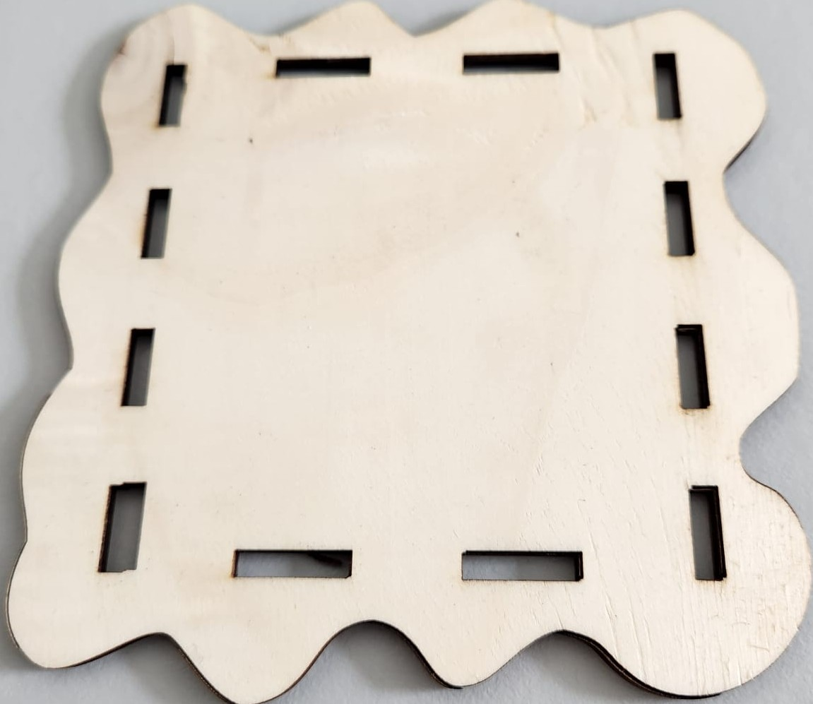
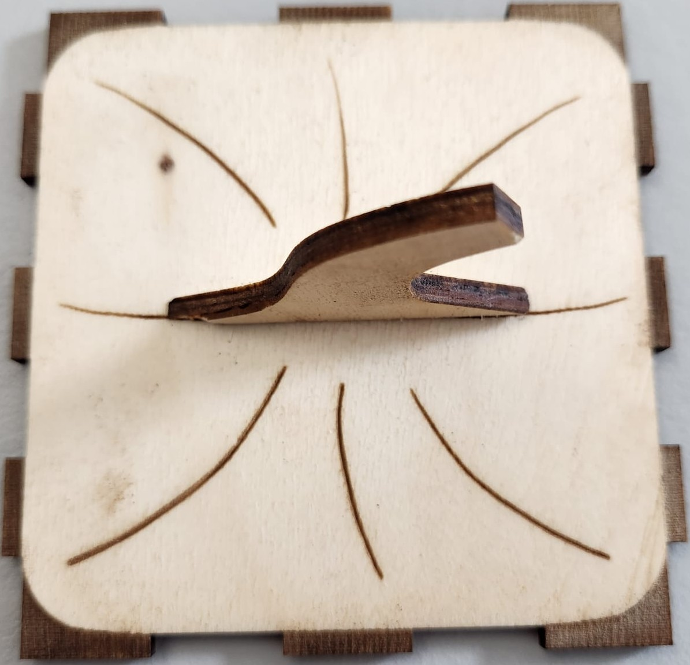

Halloweenhaus – Bauanleitung für Zuhause
  

**Wichtiger Hinweis:**
Wenn du den Lasercutter noch nie benutzt hast, ist es **verpflichtend**, die Sicherheitshinweise im [firmeninternen Moodle-Kurs zur Lasercutter-Bedienung](https://moodle.rsint.net/course/view.php?id=987) zu beachten**.  
Der Kurs erklärt die grundlegende Bedienung, Sicherheitsregeln und wichtige Einstellungen.  
Diese Anleitung hier ist eine kompakte Schritt-für-Schritt-Kurzfassung speziell für den Bau des Halloweenhauses.
  

# 1. Laserdateien vorbereiten

Öffne das Programm LightBurn **zweimal**. Das geht am einfachsten, wenn du unten in der Windows-Suchleiste nach **„LightBurn“** suchst und das Programm zweimal startest.

LightBurn ist eine Software zur Steuerung von Lasercuttern. Mit ihr kannst du Vektorgrafiken bearbeiten, Schnitt- und Gravurpfade festlegen und die finale Datei für den Lasercutter vorbereiten.

Beim Öffnen der Datei kann ein Fenster erscheinen, das dich etwas fragen möchte. Klicke hier immer auf **„Nein“** – das ist wichtig, damit nichts verändert wird.

Öffne auf der linken Seite den Ordner „lightburn“. Dort siehst du die Dateien, die du gleich brauchst. Oben rechts ist ein kleiner Pfeil nach unten – das ist der Download-Knopf. Wenn du darauf klickst, wird die Datei auf deinen Computer heruntergeladen.

Manchmal sind die **LightBurn-Dateien** ziemlich groß. Damit du alles sehen kannst, musst du ein bisschen **herauszoomen** – das geht ganz einfach mit dem **Mausrad**. So bekommst du einen besseren Überblick, als würdest du ein großes Bild von weiter weg anschauen.

Im ersten Fenster öffnest du die Datei **Kuerbis_Haus_Bausteine.lbrn2**.
Im zweiten Fenster öffnest du die Datei **Holzbauteile.lbrn2**. Diese Datei wird später am Lasercutter ausgeführt.

In der Datei **„Bausteine“** benötigst du folgende Teile:

Zubehör
Deckel
Boden
Vorderseite
Rückseite
Linke Seite
Rechte Seite
Markiere diese Teile, kopiere sie **(Strg + C)** und füge sie in die Datei **Holzbauteile.lbrn2** ein **(Strg + V)**.

Lege die Teile dort so auf der Fläche an, dass sie möglichst **wenig** Platz verbrauchen.
Wenn du ein Teil drehen möchtest, klicke es an und ziehe an einer Ecke. So kannst du es frei rotieren und besser platzieren.

Ziel ist es, eine **platzsparende** und lasertaugliche Anordnung zu erstellen, die du anschließend speichern und direkt am Lasercutter verwenden kannst.

Lege im rechten Fenster die Reihenfolge der Laserarbeiten fest. Verwende diese Reihenfolge:

**Schwarz (00)**

**Grün (03)**

**Türkis (06)**

**Blau (01)**

**Rot (02)**

  

Speichere die Datei unter einem passenden Namen. Zusammen mit der Datei **„Kunststoffbauteile“** hast du nun alle Bauteile für dein Halloweenhaus.

  

Danach musst du noch ein paar wichtige Einstellungen überprüfen:

1. Ist die richtige Position ausgewählt? Wähle **„Benutzerausgangsposition“**.

2. Ist die richtige Maschine eingestellt? Wähle **„Laser“**.

3. Bei **„Leistung Min“** und **„Leistung Max“** muss derselbe Wert eingestellt sein.

**Max** ist dabei schon richtig eingestellt. Schau einfach, ob bei **Min** ein anderer Wert steht – wenn ja, ändere ihn so, dass er **genau** wie **Max** ist.

Das Bild unten ist nur ein Beispiel – dort steht 30 / 30, aber das ist nicht der richtige Wert für alle Schnitt Ebenen.

  

Wenn alle Einstellungen stimmen, schiebst du an der Maschine den Hauptschalter auf „ON“ und klickst in LightBurn auf „Senden“.

 

Dabei erscheint ein kleines Fenster – dort klickst du einfach auf „OK“, damit die Datei an den Lasercutter übertragen wird.

  

1. Öffne die Klappe des Lasercutters und lege das Holz/Kunstoff vorsichtig ein. Halte dabei die Klappe immer mit einer Hand fest.

3. Richte das Brett so aus, dass es bündig in der oberen rechten Ecke liegt – das sorgt für einen sauberen Startpunkt.

4. Drücke den Knopf **„File“ an der Maschine – damit wird die Datei geladen.

5. Bestätige die Auswahl mit dem Knopf **„Enter“**.

6. Mit den **Pfeiltasten** an der Maschine kannst du den Laser bewegen. Fahre ihn zur oberen rechten Ecke des Werkstücks – dort beginnt später der Schnitt.

7. Öffne die Haube erneut und überprüfe die Höhe des Laserkopfs.

8. Der Abstand zum Material sollte ** ca. 5mm**  betragen. Bei gewelltem Holz richte dich nach dem höchsten Punkt des Materials. Es ist nicht schlimm, wenn der Abstand an flacheren Stellen etwas größer ist – wichtig ist, dass der Laserkopf ** nirgendwo das Material berührt**  und möglichst gleichmäßig etwa 5mm darüber liegt.

9. Falls nötig, kannst du den Laser vorsichtig nach unten ziehen, um die Höhe anzupassen

10. Wenn alles richtig eingestellt ist, drücke den Knopf **„Origin“**. Damit setzt du den Startpunkt für den Laserschnitt.

11. Mit dem Knopf **„Frame“** kannst du prüfen, ob der Schnittbereich richtig auf dem Material liegt.
    Wenn nicht, kannst du das Material vorsichtig verschieben oder die Objekte in LightBurn neu anordnen
    

  

12. Wenn alles passt, drücke zuerst den **blau** leuchtenden **„Reset“-Knopf** – **wichtig**: der blaue Knopf darf nicht mehr leuchten, wenn du schneiden willst. Danach drückst du den **grünen „St/Pau“-Knopf** (Start/Pause), um den Laservorgang zu starten.
   

  

Wenn du während des Laserns merkst, dass etwas nicht stimmt, kannst du jederzeit auf **„St/Pau“** oder **„Stop“** drücken, um den Vorgang zu unterbrechen.

Warte nun, bis der Lasercutter den Schnitt **vollständig** abgeschlossen hat.

Der Kunststoffschnitt dauert etwa **5 Minuten**, der Holzschnitt kann bis zu **2 Stunden** dauern – je nach Größe und Detail.

Während die Maschine schneidet, kannst du schon mit dem **Verkabeln und Programmieren** weitermachen – so sparst du Zeit und kommst schneller voran.

Nicht wundern, wenn es dabei raucht – das ist ganz normal! Der Laser verbrennt das Holz, und da wir keine Absaugung am Gerät haben, kann sich Rauch im Raum sammeln.
Wenn das Wetter es zulässt, öffne bitte das Fenster, damit der Rauch abziehen kann.

Wenn die Maschine fertig ist, **piepst sie einmal** – das ist dein Zeichen, dass der Schnitt **abgeschlossen** ist.

Sobald du das Piepen hörst, kannst du die ausgeschnittenen Teile **vorsichtig** herausnehmen und den restlichen Abfall entsorgen.

Stecke anschließend alle Teile einmal ohne Kleber zusammen – das nennt man **„trocken zusammenstecken“**. So kannst du prüfen, ob alles gut passt.
Falls etwas klemmt oder nicht richtig sitzt, kannst du mit Schleifpapier oder einer Feile nachhelfen.

Wenn alles passt, kannst du mit dem nächsten Schritt weitermachen: dem Programmieren – oder, wenn du das schon erledigt hast, mit dem Zusammenkleben.
  
  

# 2. Chip vorbereiten und programmieren

**Installiere** zuerst die **Arduino IDE** auf deinem Computer.
Das ist ein Programm, mit dem du deinem Chip sagen kannst, was er tun soll – zum Beispiel, wie die LED-Lichter leuchten sollen.
  

**Bibliothek installieren**

  

Öffne die Arduino IDE.
-Gehe oben auf **„Tools“ → „Manage Libraries“**.
-Suche nach **„Adafruit NeoPixel by Adafruit“**.
-**Installiere die Version 1.15.1** – sie sorgt dafür, dass die LED-Lichter später richtig gesteuert werden können.

  

Nimm den Chip aus deinem Bausatz – das ist sozusagen das Gehirn deines Halloweenhauses.
Er sorgt dafür, dass die LED-Lichter genau das tun, was du programmiert hast.
Verbinde den Chip mit einem USB-C-Kabel mit deinem Computer.

  

Damit der Chip funktioniert, brauchst du:

**MiniCore-Erweiterung** für die Arduino IDE:

Öffne **File** → **Preferences**
Füge bei **„Additional Board Manager URLs“** diesen Link ein:
**https://mcudude.github.io/MiniCore/package_MCUdude_MiniCore_index.json**

  

Gehe zu **Tools** → **Board** → **Board Manager**
Suche nach **MiniCore** und **installiere** es

  

Chip-Einstellungen setzen:

**Tools → Board → ATmega328PB (MiniCore)**

**Tools → Clock → External 16 MHz**

**Tools → Bootloader → Yes (UART0)**

**Tools → Programmer → AVRISP mkII**

**Tools → Port → Wähle den richtigen COM-Port**

  

Tipp zum **COM-Port**:

Wenn du **nicht** weißt, welcher Port der richtige ist:

Stecke den Chip **aus** – also zieh das USB-Kabel vom Computer ab.

Öffne in der **Arduino IDE** oben das Menü **„Tools → Port“**.

Schau dir an, welche COM-Ports gerade angezeigt werden.

Stecke den Chip wieder **ein** – also verbinde ihn erneut mit dem USB-Kabel.

Gehe nochmal auf **„Tools → Port“**.

Jetzt siehst du einen neuen **COM-Port**, der vorher nicht da war – **das ist dein Chip!**

So kannst du ganz sicher sein, dass du den **richtigen** Port ausgewählt hast.
  

Jetzt musst du den Code einfügen:

1. Gehe auf die GitHub-Seite des Halloween-Hauses.
2. Suche dort nach der Datei **„LED_Programmierung.ino“** im Ordner **„Code"**.
3. Kopiere den gesamten Text aus der Datei.
4. Füge ihn in das neue Fenster der Arduino IDE ein.
  

In dieser Datei steht, wie sich dein Chip verhalten soll. Hier sind die Funktionen des Würfels:

**1x drücken** = An / Aus

**2x drücken** = Farbverlauf-Modus

**Gedrückt halten / loslassen** = Farbauswahl für Buntes Feuer

**3x drücken** = Buntes Feuer-Modus

**4x drücken** = Kerzenlicht
  

Oben links in der Arduino IDE siehst du einen Pfeil – das ist der **„Upload“-Button**.
Klicke darauf, um den Code auf deinen Chip zu übertragen.

  

Was passiert nach dem Hochladen?

Wenn **keine Fehlermeldun**g erscheint, hat alles geklappt.
Es kann sein, dass ein **Warnhinweis** erscheint – das ist normal und kann ignoriert werden.
  

# 3. Verkabeln 

Jetzt geht es ans **Verkabeln** – damit dein Chip und die LED richtig miteinander sprechen können.

**Wichtiger Hinweis**: Bevor du mit der Verkabelung beginnst, **trenne unbedingt die Stromversorgung vom Arduino-Chip**. So vermeidest du Kurzschlüsse und schützt die Bauteile vor Schäden. Erst wenn alle Kabel sicher verbunden sind, darf der Chip wieder mit Strom versorgt werden.

**Button:**

Eine Seite kommt an **GND**

Die andere Seite an **2**

(Diese Kabel sind schon vorbereitet – du musst hier nichts mehr machen.)

**LED:**

**Data-In** kommt an **8**

**+5V** kommt an **5V**

**GND** kommt an **GND**

Achte darauf, dass alle Verbindungen fest sitzen – so funktioniert später alles zuverlässig.

Für die Verkabelung brauchst du sogenannte Steckleitungen:
  
Männlich bedeutet: mit einem festen Pin zum Einstecken.

  

Weiblich bedeutet: mit einer Buchse zum Aufnehmen eines Pins.

  

Du brauchst passende Kombinationen, damit alles gut verbunden werden kann.
  
  

# 4. Haus zusammenkleben

Lass den Kleber etwa 10 Minuten vorheizen
und sei beim Kleben schnell, denn Heißkleber kühlt rasch ab und wird sofort fest. Verwende ihn zum Zusammenkleben des Hauses – aber Vorsicht: Der Kleber wird sehr heiß! Lass dir unbedingt von einem Erwachsenen helfen, damit du dich nicht verbrennst.

Tipp: Beim Kleben unbedingt darauf achten, dass alle Teile richtig sitzen und vollständig in den Aussparungen stecken.
Wenn etwas schiefgeht, entferne die Kleberreste vorsichtig und schleife die Stelle leicht nach – so passt alles wieder sauber zusammen.

  

Damit beim Kleben nichts schmutzig wird, gehst du so vor:

1. Lege ein paar Papiertücher auf deinen Tisch – das schützt die Fläche.
2. Lege zwei Holzstäbchen unter die Bodenplatte, damit sie ein bisschen erhöht ist.

  

1. Klebe zuerst die Rückwand und die linke Seitenwand in die Bodenplatte.
   Du kannst vorsichtig von oben etwas Sekundenkleber in die kleinen Löcher tropfen lassen.
   Achte darauf, dass die Teile gerade sitzen – das macht den späteren Zusammenbau einfacher.  

  

2. Klebe den schmalen Chip-Halter hinten bündig in die Ecke der Bodenplatte.
Die lange Seite zeigt zur Seitenwand, die kurze Seite zur Rückwand.

  

3. Bevor du den Chip befestigst, stecke den Knopf durch die vorgesehene Bohrung in der Vorderseite.
Fixiere ihn mit der Mutter, damit er fest sitzt und sich nicht mehr bewegt.

  

4. Jetzt wird der Chip auf den Chiphalter geklebt. So geht’s:

Lege den Chip so an den Chiphalter dran, dass die Pins (die silbernen Beinchen) gut anliegen.
Der Chip soll oben ein kleines Stück auf dem Chiphalter aufliegen, damit er stabil sitzt.
Die linke schwarze Buchse auf dem Chip soll flach an der Rückwand anliegen.

  

5. Jetzt kommt der zweite Chiphalter dran – der wird an die Seite geklebt, wo später die Vorderseite des Hauses ist.

Er liegt vorne an dem Chip mit der langen Seite an
Er liegt an dem anderen Chpihalter mit der kurzen Seite an

  

6. Befestige die LED mittig an der Rückwand. Drücke sie leicht an, damit sie gut hält und später schön leuchtet.

  

7. Klebe die zweite Seitenwand in die Bodenplatte. Sie kommt gegenüber der ersten Seitenwand.

  

8. Gib einen dünnen Streifen Heißkleber in die inneren Ecken und verstreiche ihn mit einem kleinen Holzstück glatt. So sehen die Kanten sauber aus.

  

10. Klebe die Vorderseite in die Bodenplatte und verbinde die Ecken mit den Seitenwänden.

  

11. Klebe die Frontscheibe auf die Vorderseite. Sie sollte gut aufliegen.

  

12. Klebe die Seitenscheiben links und rechts auf.
Sie passen genau in die Aussparungen der Seitenwände.
Achte darauf, dass die rechte Scheibe etwas größer ist als die linke. Ihre lange Seite zeigt senkrecht nach oben – das wird die Höhe der Scheibe.

  

13. gib in alle inneren Ecken des Hauses noch einmal eine kleine Ladung Heißkleber.
Du musst den Kleber diesmal nicht verstreichen – er soll einfach für extra Halt sorgen.

  

Tipp: Mach dir keine Sorgen, wenn es von innen etwas unordentlich aussieht – das passiert beim Basteln und ist völlig okay. Hauptsache, alles hält gut!

  

14. Stecke den Stumpf durch die gelaserte Bohrung in der Mitte des Deckels und klebe ihn fest.

  

15. Setze den Deckel auf das Haus – jetzt ist dein Halloweenhaus fertig!

  
  

# Geschafft!

Dein Halloweenhaus ist jetzt fertig! Viel Spaß beim Dekorieren und ein gruselig schönes Halloween!
