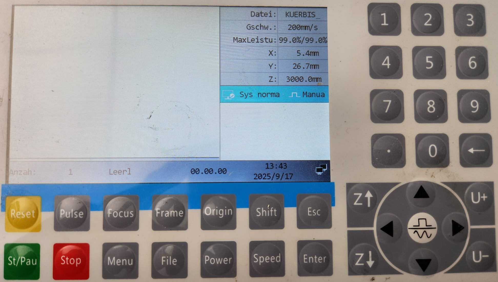
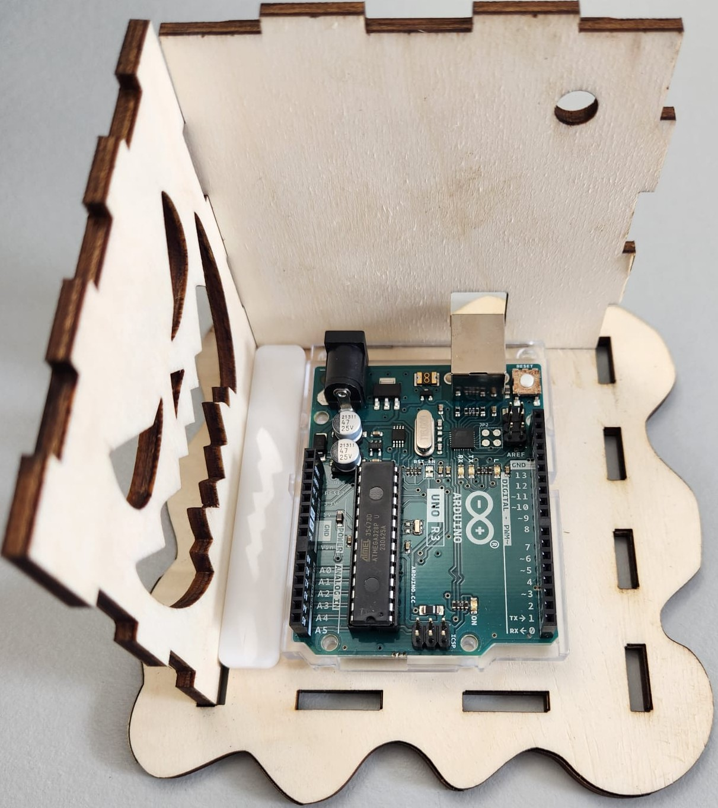
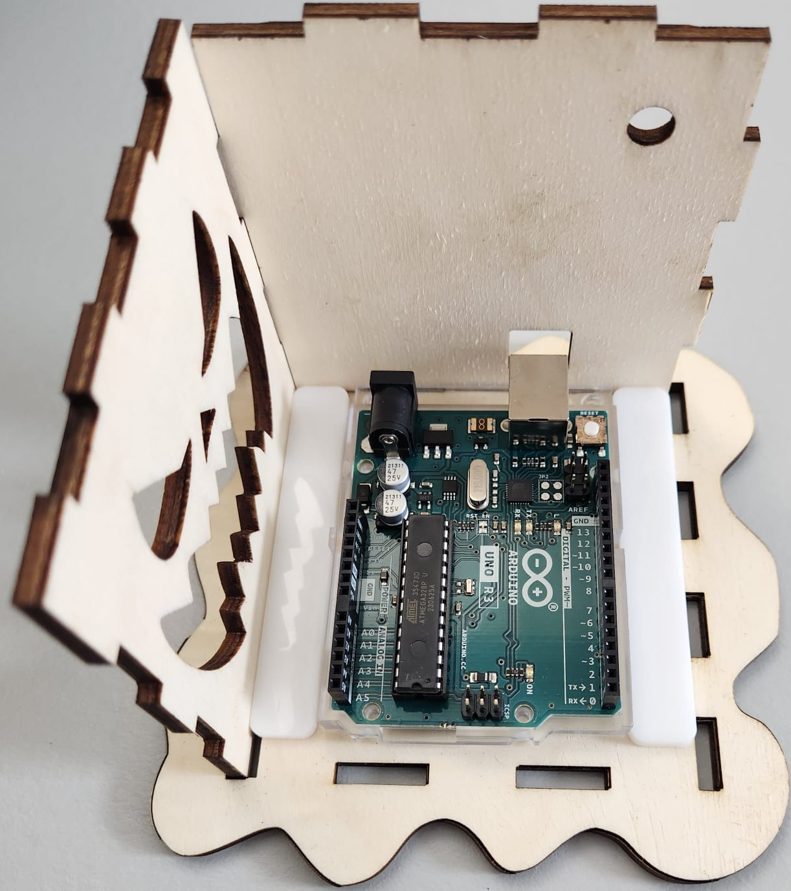

Halloweenhaus – Bauanleitung für Zuhause
  

**Wichtiger Hinweis:**
Wenn du den Lasercutter noch nie benutzt hast, ist es **verpflichtend**, die Sicherheitshinweise im [firmeninternen Moodle-Kurs zur Lasercutter-Bedienung](https://moodle.rsint.net/course/view.php?id=987) zu beachten**.  
Der Kurs erklärt die grundlegende Bedienung, Sicherheitsregeln und wichtige Einstellungen.  
Diese Anleitung hier ist eine kompakte Schritt-für-Schritt-Kurzfassung speziell für den Bau des Halloweenhauses.
  

# 1. Laserdateien vorbereiten

Öffne das Programm LightBurn **zweimal**. Das geht am einfachsten, wenn du unten in der Windows-Suchleiste nach **„LightBurn“** suchst und das Programm zweimal startest.

LightBurn ist eine Software zur Steuerung von Lasercuttern. Mit ihr kannst du Vektorgrafiken bearbeiten, Schnitt- und Gravurpfade festlegen und die finale Datei für den Lasercutter vorbereiten.

Öffne auf der linken Seite den Ordner „lightburn“. Dort siehst du die Dateien, die du gleich brauchst. Oben rechts ist ein kleiner Pfeil nach unten – das ist der Download-Knopf. Wenn du darauf klickst, wird die Datei auf deinen Computer heruntergeladen.

Manchmal sind die **LightBurn-Dateien** ziemlich groß. Damit du alles sehen kannst, musst du ein bisschen **herauszoomen** – das geht ganz einfach mit dem **Mausrad**. So bekommst du einen besseren Überblick, als würdest du ein großes Bild von weiter weg anschauen.

Im ersten Fenster öffnest du die Datei **Kuerbis_Haus_Bausteine.lbrn2**.
Im zweiten Fenster öffnest du die Datei **Holzbauteile.lbrn2**. Diese Datei wird später am Lasercutter ausgeführt.

In der Datei **„Bausteine“** benötigst du folgende Teile:

Zubehör
Deckel
Boden
Vorderseite
Rückseite
Linke Seite
Rechte Seite
Markiere diese Teile, kopiere sie **(Strg + C)** und füge sie in die Datei **Holzbauteile.lbrn2** ein **(Strg + V)**.

Lege die Teile dort so auf der Fläche an, dass sie möglichst **wenig** Platz verbrauchen.
Wenn du ein Teil drehen möchtest, klicke es an und ziehe an einer Ecke. So kannst du es frei rotieren und besser platzieren.

Ziel ist es, eine **platzsparende** und lasertaugliche Anordnung zu erstellen, die du anschließend speichern und direkt am Lasercutter verwenden kannst.

Lege im rechten Fenster die Reihenfolge der Laserarbeiten fest. Verwende diese Reihenfolge:

**Schwarz (00)**

**Grün (03)**

**Türkis (06)**

**Blau (01)**

**Rot (02)**

  

Speichere die Datei unter einem passenden Namen. Zusammen mit der Datei **„Kunststoffbauteile“** hast du nun alle Bauteile für dein Halloweenhaus.

  

Bevor du mit dem Lasern beginnst, musst du unbedingt die Maschine einschalten. Dafür gibt es einen großen schwarzen Schalter – schiebe ihn einfach auf **„ON“**.

  

Danach musst du noch ein paar wichtige Einstellungen überprüfen:

1. Ist die richtige Position ausgewählt? Wähle **„Benutzerausgangsposition“**.

2. Ist die richtige Maschine eingestellt? Wähle **„Laser“**.

3. Bei **„Leistung Min“** und **„Leistung Max“** muss derselbe Wert eingestellt sein.

  

Wenn alle Einstellungen stimmen, klickst du auf **„Senden“**. Danach kannst du zum Lasercutter gehen.Beim Cutter:

1. Öffne die Klappe des Lasercutters und lege das Holz vorsichtig ein. Halte dabei die Klappe immer mit einer Hand fest.

2. Wenn das Holz mehr als **2mm** gewellt ist, lege etwas Schweres darauf, damit es flach liegt.

3. Richte das Brett so aus, dass es bündig in der Ecke liegt – das sorgt für einen sauberen Startpunkt.

4. Drücke den Knopf **„File“ an der Maschine – damit wird die Datei geladen.

5. Bestätige die Auswahl mit dem Knopf **„Enter“**.

6. Mit den **Pfeiltasten** an der Maschine kannst du den Laser bewegen. Fahre ihn zur oberen rechten Ecke des Werkstücks – dort beginnt später der Schnitt.

7. Öffne die Haube erneut und überprüfe die Höhe des Laserkopfs.

8. Der Abstand zum Material sollte nicht mehr als **5mm** betragen.

9. Falls nötig, kannst du den Laser vorsichtig nach unten ziehen, um die Höhe anzupassen

10. Wenn alles richtig eingestellt ist, drücke den Knopf **„Origin“**. Damit setzt du den Startpunkt für den Laserschnitt.

  

11. Mit dem Knopf **„Frame“** kannst du prüfen, ob der Schnittbereich richtig auf dem Material liegt.
    Wenn nicht, kannst du das Material vorsichtig verschieben oder die Objekte in LightBurn neu anordnen

  

12. Wenn alles passt, drücke zuerst den blau leuchtenden **„Reset“-Knopf** und danach den grünen **„St/Pau“-Knopf** (Start/Pause), um den Laservorgang zu starten.

Wenn du während des Laserns merkst, dass etwas nicht stimmt, kannst du jederzeit auf **„St/Pau“** oder **„Stop“** drücken, um den Vorgang zu unterbrechen.

Warte nun, bis der Lasercutter den Schnitt **vollständig** abgeschlossen hat.
Nicht wundern, wenn es dabei raucht – das ist ganz normal! Der Laser verbrennt das Holz, und da wir keine Absaugung am Gerät haben, kann sich Rauch im Raum sammeln.
Wenn das Wetter es zulässt, öffne bitte das Fenster, damit der Rauch abziehen kann.

Sobald die Maschine fertig ist, kannst du die ausgeschnittenen Teile vorsichtig herausnehmen und den restlichen Abfall entsorgen.

Stecke anschließend alle Teile einmal ohne Kleber zusammen – das nennt man **„trocken zusammenstecken“**. So kannst du prüfen, ob alles gut passt.
Falls etwas klemmt oder nicht richtig sitzt, kannst du mit Schleifpapier oder einer Feile nachhelfen.

Wenn alles passt, kannst du mit dem nächsten Schritt weitermachen: dem Programmieren – oder, wenn du das schon erledigt hast, mit dem Zusammenkleben.
  
  

# 2. Chip vorbereiten und programmieren

Installiere zuerst die Arduino IDE auf deinem Computer.
Öffne danach die Bibliotheksverwaltung – dort kannst du zusätzliche Funktionen für dein Projekt hinzufügen.

  

Installiere die Bibliothek **„Adafruit ****NeoPixel****“** (von Adafruit) in der Version **1.15.1** – sie sorgt später dafür, dass die LED-Lichter richtig gesteuert werden können.

  

Nimm den Chip aus deinem Bausatz – das ist sozusagen das Gehirn deines Halloweenhauses.
Er sorgt dafür, dass die LED-Lichter genau das tun, was du programmiert hast.
Verbinde den Chip mit einem USB-B-Kabel mit deinem Computer.

  

Öffne die Arduino IDE – das ist die Software, mit der du deinem Chip sagen kannst, was er später tun soll.
Hier schreibst du das Programm, das die LED-Lichter steuert.Klicke oben links auf 'File' und Klicke in der Arduino IDE oben links auf „File“ und dann auf „Open“.
Wähle den Ordner „Desktop“ und öffne darin den Ordner „Halloween_Haus“.
Dort findest du die Datei **„****LED_Programmierung.ino****“** – öffne sie mit einem Doppelklick.
  

In dieser Datei steht, wie sich dein Chip verhalten soll. Hier sind die Funktionen des Würfels:

**1x drücken** = An / Aus

**2x drücken** = Farbverlauf-Modus

**Gedrückt halten / loslassen** = Farbauswahl für Buntes Feuer

**3x drücken** = Buntes Feuer-Modus

**4x drücken** = Kerzenlicht
  

Oben links in der Arduino IDE siehst du einen Pfeil – das ist der **„Upload“-Button**.
Klicke darauf, um den Code auf deinen Chip zu übertragen.

  
  

# 3. Verkabeln 

Jetzt geht es ans Verkabeln – damit dein Chip und die LED richtig miteinander sprechen können.

**Button:**

Eine Seite kommt an **GND**

Die andere Seite an **D2**

(Diese Kabel sind schon vorbereitet – du musst hier nichts mehr machen.)

**LED:**

**Data-In** kommt an **D8**

**+5V** kommt an **5V**

**GND** kommt an **GND**

Achte darauf, dass alle Verbindungen fest sitzen – so funktioniert später alles zuverlässig.

Für die Verkabelung brauchst du sogenannte Steckleitungen:
  
Männlich bedeutet: mit einem festen Pin zum Einstecken.

  

Weiblich bedeutet: mit einer Buchse zum Aufnehmen eines Pins.

  

Du brauchst passende Kombinationen, damit alles gut verbunden werden kann.
  
  

# 4. Haus zusammenkleben

Jetzt wird das Haus zusammengeklebt.
Verwende dafür Heißkleber – aber Vorsicht: Der Kleber wird sehr heiß!
Lass dir dabei unbedingt von einem Erwachsenen helfen, damit du dich nicht verbrennst.

  

1. Klebe zuerst die Rückwand und eine Seitenwand in die Bodenplatte.  
   Achte darauf, dass die Teile gerade sitzen – das macht den späteren Zusammenbau einfacher.  

  

2. Klebe den ersten Chip-Halter hinten bündig in die Ecke der Bodenplatte.
Die lange Seite zeigt zur Seitenwand, die kurze Seite zur Rückwand.

  

3. Bevor du den Chip befestigst, stecke den Knopf durch die vorgesehene Bohrung in der Vorderseite.
Fixiere ihn mit der Mutter, damit er fest sitzt und sich nicht mehr bewegt.

  

4. Klebe die Plastikhalterung für den Chip bündig an den Chip-Halter und die Rückwand.
Sie sollte gut anliegen, damit der Chip später sicher sitzt.

  

5. Klebe den Chip genau in die Mitte der Plastikhalterung. Drücke ihn vorsichtig fest, damit er gut hält und später nicht verrutscht.

  

6. Klebe den zweiten Chip-Halter direkt anschließend an die Plastikhalterung und die Rückwand. Achte darauf, dass er bündig sitzt, damit später alles gut zusammenpasst.

  

7. Befestige die LED mittig an der Rückwand. Drücke sie leicht an, damit sie gut hält und später schön leuchtet.

  

8. Klebe die zweite Seitenwand in die Bodenplatte. Sie kommt gegenüber der ersten Seitenwand.

  

9. Gib einen dünnen Streifen Heißkleber in die inneren Ecken und verstreiche ihn mit einem kleinen Holzstück glatt. So sehen die Kanten sauber aus.

  

10. Klebe die Vorderseite in die Bodenplatte und verbinde die Ecken mit den Seitenwänden.

  

11. Klebe die Frontscheibe auf die Vorderseite. Sie sollte gut aufliegen.

  

12. Klebe die Seitenscheiben links und rechts auf. Sie passen genau in die Aussparungen der Seitenwände.

  

13. gib in alle inneren Ecken des Hauses noch einmal eine kleine Ladung Heißkleber.
Du musst den Kleber diesmal nicht verstreichen – er soll einfach für extra Halt sorgen.

  

Tipp: Mach dir keine Sorgen, wenn es von innen etwas unordentlich aussieht – das passiert beim Basteln und ist völlig okay. Hauptsache, alles hält gut!

  

14. Stecke den Stumpf durch die gelaserte Bohrung in der Mitte des Deckels und klebe ihn fest.

  

15. Setze den Deckel auf das Haus – jetzt ist dein Halloweenhaus fertig!

  
  

# Geschafft!

Dein Halloweenhaus ist jetzt fertig! Viel Spaß beim Dekorieren und ein gruselig schönes Halloween!
